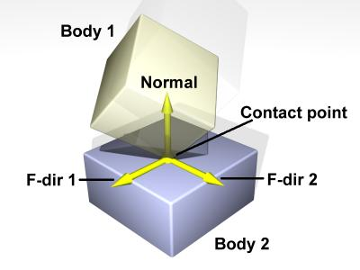
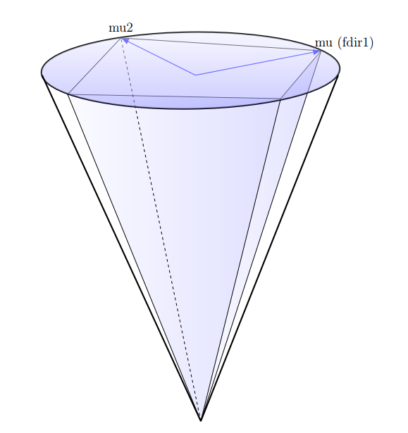
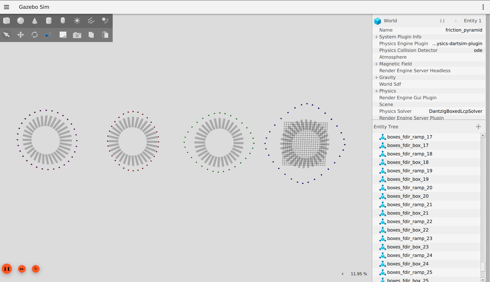

# Friction Pyramid

The [previous test](../friction/README.md) showed friction is not an isotropic property, i.e. it does not work the same in every direction. The default friction model used by gazebo-sim (that uses ODE as a physics collision detector) is a pyramid model. The following image illustrates how the collision engine establishes a collision frame whenever two surfaces meet.



The friction pyramid is obtained from three vectors:
- the direction and magnitude of the normal force (the height of the pyramid)
- a vector with direction `fdir1` and magnitude proportional to the normal force and `mu`
- a vector with direction `fdir2` (always perpendicular to the first) with magnitude proportional to the normal force and `mu2`.



Friction in Gazebo is specified in the scene file as an ODE parameter (even if the physics engine is DART...)

```xml
<link>
    ...
    <collision name="${name}_collision">
    ...
        <surface>
            <friction>
                <ode>
                    <mu>1</mu>
                    <mu2>1</mu2>
                    <fdir1>1 0 0</fdir1>
                </ode>
            </friction>
        </surface>
    </collision>
</link>
```

If `fdir1` is specified, it is the direction of vector `fdir1` of the collision reference frame with respect to the parent link reference frame. `fdir2` is obtained via the right-hand rule given `fdir1` and the contact normal. If not specified, `fdir1` and `fdir2` are the first and second world axes, respectively X and Y.

This test lets boxes slide down ramps to highlight the pyramid behavior. Each cluster of boxes has a different arrangement of `mu`, `mu2` and `fdir1`. The cluster on the left is the only one where `fdir1` is specified to point down the ramp, while in the other cases the boxes moving along world axis X (vertical) slide more or less then boxes moving along world axis Y (horizontal) creating diamond patterns.



PS: this simulation is awfully slow.
