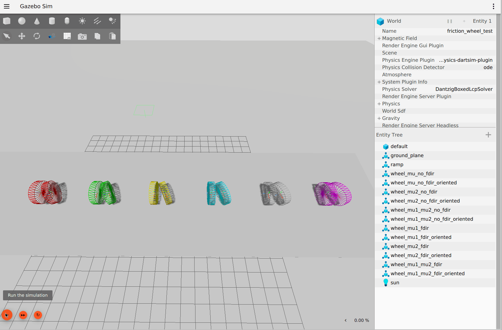

# Wheel Friction

Other tests have shown the behaviour of the friction coefficients in case of sliding contacts. When it comes to wheels, however, things are different because they introduce rolling contacts, i.e. a type of kinematic constraint where sliding is not allowed. In order to understand how to simulate this situation, I tested what is the best approach in modeling wheel motion and rolling contacts. 

The test puts a bunch of wheels on a ramp and lets them roll off the slope. Some wheels are pointed right down the slope, while some others are placed at an angle to test lateral friction. The aim is to find an arrangement of `mu`, `mu2` and `fdir1` that allows for a realistic modeling of the wheel rolling contact.

The test runs as follows:

| Color | `mu` | `mu2` | `fdir` | results | 
| - | - | - | - | - |
|  **red**      | 1 | 0 | 0 0 0 | both roll rotated wheel slides laterally, no separation | 
|  **green**    | 0 | 1 | 0 0 0 | both slide, no rolling, no separation | 
|  **yellow**   | 1 | 1 | 0 0 0 | both roll, no sliding, wheels separate | 
|  **cyan**     | 1 | 0 | 1 0 0 | both roll, rotated wheel slides laterally, no separation | 
|  **gray**     | 0 | 1 | 1 0 0 | both slide, no rolling, wheels separate |
|  **purple**   | 1 | 1 | 1 0 0 | both roll, no sliding, wheels separate | 

Everything behaved more or less as I was expecting, except the gray wheels which I expected to behave exactly like the cyan ones. Seems like the best way to model a wheel rolling contact is either the **yellow** or **purple** approach.