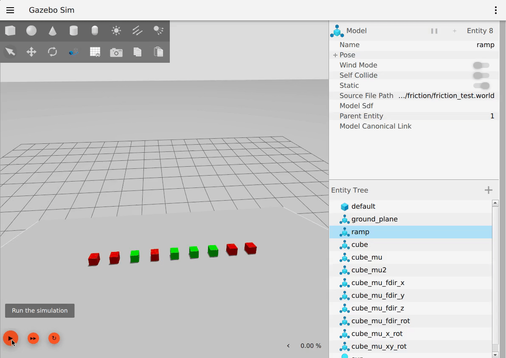

# Friction

Friction is the resistance to motion of one object moving relative to another. Here we are modeling kinetic friction by setting the coefficient of friction. By default ODE implements friction with a pyramidal model, which relies on the definition of three directions:
- contact force direction
- first friction direction
- second friction direction

For more info on pyramid friction model:
- [ancient ODE documentation](https://www.ode.org/ode-latest-userguide.html#sec_7_3_7) (but still relevant to Gazebo Harmonic + DART)
- [ancient Gazebo-classic tutorial](https://classic.gazebosim.org/tutorials?tut=physics_params) (again, relevant to Harmonic + DART)


The coefficient of friction in version 1.7 of the sdformat is modeled as an ODE parameter with `mu` as the coefficient for the first friction direction and `mu2` as the coefficient for the second friction direction. In case there is no `mu2`, it is assumed to be equal to `mu`. There is an additional parameter, `fdir1`that can specify a specific primary friction direction relative to the link, otherwise it is modeled relative to the world.

## Example code snippet

```xml
<link>
    ...
    <collision name="${name}_collision">
    ...
        <surface>
            <friction>
                <ode>
                    <mu>1</mu>
                    <mu2>1</mu2>
                    <fdir1>1 0 0</fdir1>
                </ode>
            </friction>
        </surface>
    </collision>
</link>
```

## Results


Red cubes are the ones I would expect to stay still, green means go. From left to right:

* **Cube1** Default friction.  [sdformat](http://sdformat.org) states that if no friction is set, mu1 and mu2 are set to 1 (high friction). Therefore, this cube shouldn't move.
* **Cube2** `mu=1`, `mu2=0`.  The ramp is pointed down the `X` axis.  Therefore, I expect that with a high mu along that axis, the cube will not move
* **Cube3** `mu=0`, `mu2=1`.  The ramp is pointed down the `X` axis.  Therefore, I expect that with no friction along this direction, the cube will move down the ramp.
* **Cube4** `mu=1`, `mu2=0`, `fdir1=1 0 0` (pointed down the ramp).  Since the mu value is aligned with the ramp, I expect the block to stay still.
* **Cube5** `mu=1`, `mu2=0`, `fdir1=0 1 0` (pointed toward the sides of the ramp).  Since the mu value is perpendicular to the ramp, I expect the block to move.
* **Cube6** `mu=1`, `mu2=0`, `fdir1=0 0 1` (pointed up).  Since the mu value is perpendicular to the ramp, I expect the block to move.
* **Cube7** `mu=0`, `mu2=1`, `fdir1=1 0 0`. `fdir1` is pointed in the direction of the cube x axis, which points perpendicular to the ramp since the cube is rotated 90 degrees around its pitch angle. Regardless of `mu` I expect the block to move.
* **Cube8** `mu=1` rotated along the X-axis.  Since only setting mu should set both values, I expect the result to be rotation agnostic and remain stationary.
* **Cube9** `mu=1` rotated along the X and Y-axis.  Since only setting mu should set both values, I expect the result to be rotation agnostic and remain stationary.

Everything seems to behave the way I deduced from the documentation, except for cube 6. In that case, `fdir1=0 0 1` causes the cube to remain stationary. Intuitively, `mu2` (which is 0 in the test) would be applied to all the ramp plane since `fdir1` and the contact normal are collinear, hence letting the cube move if `mu2` is small. This though does not happen, as long as we don't wiggle `fdir1` around a little (e.g. `0 0.01 0.99`). In this case, everything behaves as expected.